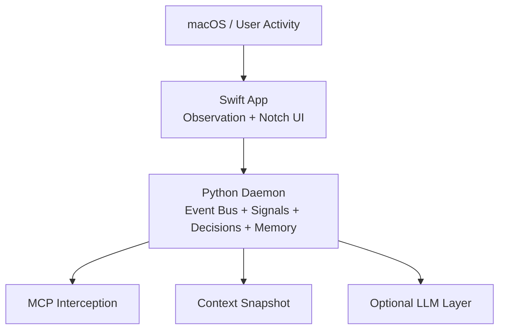
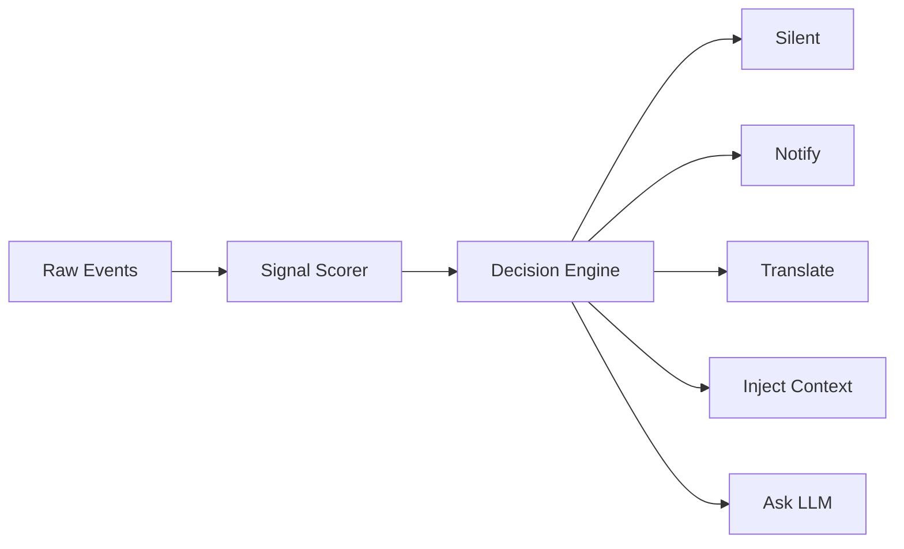
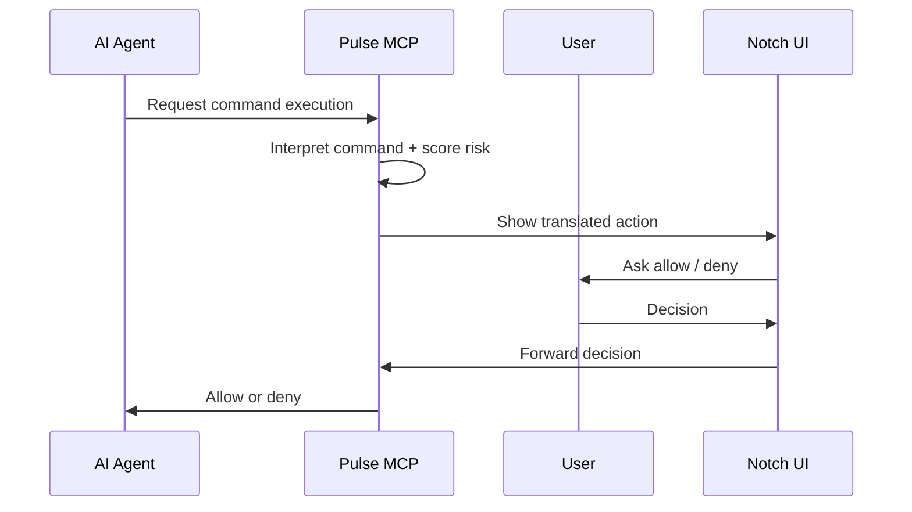

# Pulse

> Ambient macOS agent · Local layer for context, memory, and control between you and AI tools  
> Stack: Swift (UI) + Python (daemon) · Independent · Local-first

---

## Vision

Pulse is a local layer that runs quietly on your Mac. It observes what you do, understands your working context, and places itself intelligently between you and the AI tools you use.

The starting problem is simple: when an agent wants to run a command, modify files, or act inside your environment, you do not always have a clear understanding of what is happening. Pulse acts as a local control interface between the human and the agent.

In practice, Pulse:
- lives around the Mac notch,
- observes your work context,
- intercepts selected agent actions,
- translates commands into readable language,
- scores risk,
- builds reusable local memory and context.

Foundational principle:

> Anything that can be decided without an LLM should be decided without an LLM.  
> The LLM should only intervene to interpret, summarize, or resolve ambiguity.

---

## What Pulse is not

- Not a general-purpose chatbot or a permanent chat window inside the notch.
- Not an LLM wrapper.
- Not a competitor to existing AI tools.
- Not dependent on Cortex.
- Not an autonomous agent that decides for you.

Pulse is a local supervision, memory, and control layer.

---

## Architecture

Pulse is built around three layers.

```text
macOS events
    ↓
Swift observation layer
    ↓
Python local cognitive engine
    ↓
Optional LLM enrichment
```

More detailed view:



### Layer 1 — System observation (Swift)

The Swift layer observes the system and emits raw events:
- active application,
- file changes,
- clipboard updates,
- screen activity,
- interactions related to the notch UI.

It does not make decisions. It only sends raw signals to the local daemon.

### Layer 2 — Local cognitive engine (Python)

The Python daemon is the core of Pulse. It:
- receives events,
- maintains current state,
- computes session signals,
- applies deterministic rules,
- persists the session in SQLite,
- extracts durable memory into Markdown.

This layer should cover as many cases as possible without an LLM.

### Layer 3 — Optional LLM

The LLM only steps in when a deterministic layer is no longer enough:
- obscure commands,
- session summaries,
- explicit user questions,
- context enrichment.

---

## Project structure

```text
Pulse/
├── App/                 # SwiftUI macOS app
├── daemon/              # Python daemon
├── tests/               # Python tests
├── docs/                # Publishable documentation
└── test_e2e.py          # E2E smoke test
```

### macOS app

The Swift app handles:
- the interface around the notch,
- daemon state polling,
- system observation,
- sending events to the daemon,
- a context dashboard,
- a recent activity panel,
- a `Services` panel,
- a streaming chat with Pulse.

### Python daemon

The daemon handles:
- the Event Bus,
- the `StateStore`,
- the `SignalScorer`,
- the `DecisionEngine`,
- SQLite session memory,
- persistent memory extraction,
- local HTTP routes split by domain (`runtime`, `assistant`, `memory`, `mcp`),
- MCP interception.

---

## System observation

Pulse observes several dimensions of local activity:
- active app,
- touched files,
- clipboard,
- screen lock / wake,
- agent commands intercepted via MCP.

The goal is not to log everything indiscriminately, but to build useful working context.

These events are then transformed into signals such as:
- active project,
- active file,
- probable task,
- friction level,
- focus level,
- recent apps,
- clipboard context.

---

## Local decision engine

The local decision engine applies deterministic rules based on computed signals.

Examples of possible decisions:
- stay silent during deep focus,
- translate an intercepted command,
- notify when a debugging context is detected,
- signal high friction,
- suggest a session summary,
- prepare context injection.

The goal is to minimize noise. Pulse should only speak when it adds clear value.



---

## Command Interpreter

The Command Interpreter is the central piece of the first version of Pulse.

It is used to:
- interpret shell commands,
- detect known destructive patterns,
- produce a readable translation,
- assign a risk level,
- determine whether an LLM is required.

The idea is to cover common cases without an external model, and only fall back to an LLM for rare or unclear commands.

---

## Scoring engine

Pulse also embeds a scoring engine ported from Cortex.

This engine is used to estimate the risk or fragility of files based on several technical signals, for example:
- complexity,
- depth,
- churn,
- function size,
- parameters,
- fan-in.

The goal is to provide structural context on the code being modified, without depending on a separate external tool.

---

## Structured memory

Pulse uses a three-level local memory model:

- Ephemeral: recent events kept in RAM.
- Session: current state stored in SQLite.
- Persistent: durable facts stored in Markdown.

Target layout:

```text
~/.pulse/
├── memory/
│   ├── MEMORY.md
│   ├── habits.md
│   ├── projects.md
│   └── sessions/
├── session.db
└── settings.json
```

### What Pulse remembers

Persistent memory is mainly meant for:
- known projects,
- work habits,
- selected preferences,
- session summaries.

The goal is not to keep a giant chronological log, but to maintain compact, reusable memory.

---

## MCP and command interception

Pulse can register as an MCP server in order to intercept selected commands from agents such as Claude Code.

The intended flow is:



This gives a readable human control layer over agent actions.

---

## Context injection

Pulse progressively builds a local context snapshot that can be injected into an AI conversation.

That context can include:
- current project,
- active file,
- session duration,
- recent apps,
- focus level,
- probable task,
- items from persistent memory.

The goal is to avoid re-explaining your working context manually in every conversation.

---

## Notch UI

The notch interface is still designed as an ambient surface, but it now exposes several operational panels.

Main panels:
- `Dashboard`: current context, friction, probable task, session, quick input,
- `Chat`: streamed response token by token,
- `Observation`: recent activity with time indicators,
- `Services`: daemon, observation, LLM, and model selection,
- `Intercepted command`: translation + allow / deny for MCP.

The role of the UI is to be visible at the right moment without becoming intrusive.

---

## Swift ↔ Python protocol

Communication between the Swift app and the Python daemon happens over local HTTP on `localhost`.

Main routes:
- `GET /ping`
- `POST /event`
- `GET /state`
- `GET /insights`
- `POST /ask`
- `POST /ask/stream`
- `GET /context`
- `GET /llm/models`
- `POST /llm/model`
- `POST /daemon/pause`
- `POST /daemon/resume`
- `POST /daemon/shutdown`
- `POST /mcp/decision`

Swift acts as a client of the daemon, while the daemon centralizes state and decisions.

---

## macOS permissions

Because Pulse observes the local system, it implies some macOS permissions depending on which features are active:
- app observation,
- filesystem events,
- clipboard access,
- floating UI presence,
- possible automatic startup.

These permissions should remain minimal and consistent with the project's local-first nature.

---

## Configuration

Pulse is designed to remain locally configurable:
- LLM provider,
- model,
- provider memory behavior (`keep_alive`, `num_ctx`),
- injection policy,
- memory behavior,
- daemon options,
- automatic startup.

The goal is not to multiply settings, but to keep a local layer that adapts to the workstation.

---

## Quick start

### 1. Start the daemon

Create a Python environment, install daemon dependencies, then run `daemon/main.py` or install the development LaunchAgent.

### 2. Start the macOS app

Open `App/App.xcodeproj` in Xcode and run the application.

### 3. Connect an MCP-compatible agent

Configure the agent to point to Pulse's local MCP server.

### 4. Verify memory output

After a meaningful work session, check:
- `~/.pulse/session.db`
- `~/.pulse/memory/projects.md`
- `~/.pulse/memory/habits.md`

### 5. Verify the notch

From the notch, verify:
- `Services` for daemon pause/resume,
- `Observation` for the recent timeline,
- `Dashboard` for current context,
- `Chat` for a streamed response.

---

## Roadmap

### Phase 1 — MVP
- Functional Command Interpreter
- Notch UI with allow / deny
- MCP integration
- Stable Python daemon

### Phase 2 — Local intelligence
- Complete signal scoring
- Persistent memory
- Embedded Cortex scoring
- More deterministic decisions

### Phase 3 — Context
- Context injection
- Session summaries
- Richer dashboard

### Phase 4 — Generalization
- Support for other AI agents
- Quick actions from the notch
- UI and workflow expansion

---

*Pulse v2.0 — Swift (macOS) + Python*  
*Local-first, deterministic-first, LLM-optional*
