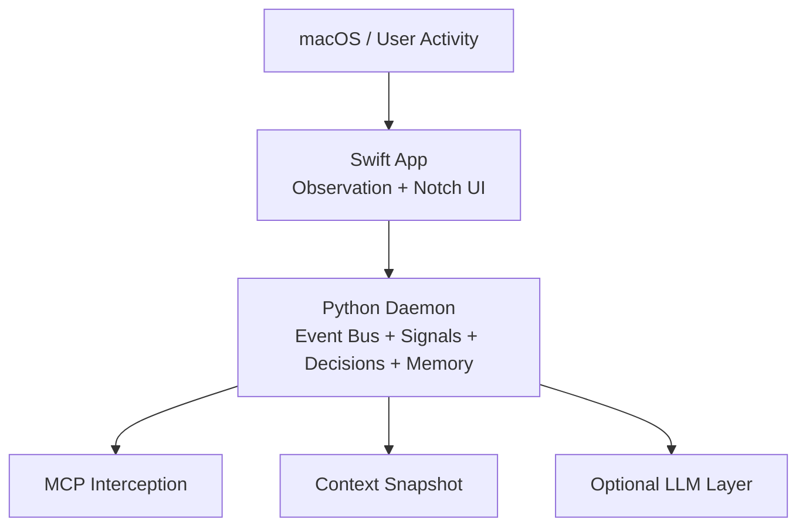
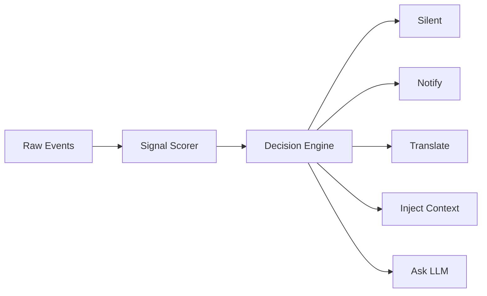
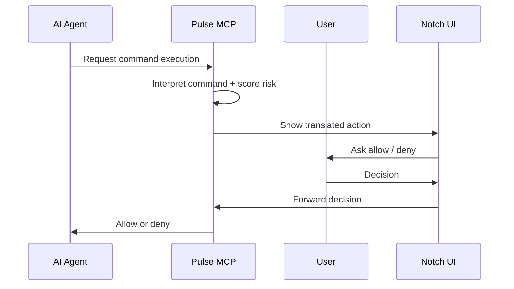

# Pulse

> Agent ambiant macOS · Couche locale de contexte, mémoire et contrôle entre toi et les IA  
> Stack : Swift (UI) + Python (daemon) · Indépendant · Local-first

---

## Vision

Pulse est une couche locale qui tourne en silence sur ton Mac. Il observe ce que tu fais, comprend le contexte de ton travail, et s'intercale intelligemment entre toi et les IA que tu utilises.

Le problème de départ est simple : quand un agent veut lancer une commande, modifier des fichiers ou agir dans ton environnement, tu n'as pas toujours une lecture claire de ce qui est en train de se passer. Pulse sert d'interface de contrôle locale entre l'humain et l'agent.

Concrètement, Pulse :
- vit dans l'encoche du Mac,
- observe ton contexte de travail,
- intercepte certaines actions d'agents,
- traduit les commandes en langage lisible,
- score le risque,
- construit une mémoire locale et un contexte réutilisable.

Principe fondateur :

> Tout ce qui peut être décidé sans LLM doit être décidé sans LLM.  
> Le LLM n'intervient que pour comprendre, résumer, ou arbitrer un flou.

---

## Ce que Pulse n'est pas

- Pas un chatbot dans l'encoche.
- Pas un wrapper LLM.
- Pas un concurrent des IA existantes.
- Pas dépendant de Cortex.
- Pas un agent autonome qui décide à ta place.

Pulse est une couche locale de supervision, de mémoire et de contrôle.

---

## Architecture

Pulse repose sur trois couches.

```text
macOS events
    ↓
Swift observation layer
    ↓
Python local cognitive engine
    ↓
Optional LLM enrichment
```

Version plus détaillée :



### Couche 1 — Observation système (Swift)

La couche Swift observe le système et émet des événements bruts :
- application active,
- changements de fichiers,
- presse-papiers,
- activité écran,
- interactions liées à l'UI notch.

Elle ne décide rien. Elle transmet uniquement des signaux bruts au daemon local.

### Couche 2 — Moteur cognitif local (Python)

Le daemon Python est le cœur de Pulse. Il :
- reçoit les événements,
- maintient l'état courant,
- calcule des signaux de session,
- applique des règles déterministes,
- persiste la session en SQLite,
- extrait une mémoire durable en Markdown.

Cette couche doit couvrir le maximum de cas sans LLM.

### Couche 3 — LLM optionnel

Le LLM n'intervient que dans les cas où une couche déterministe n'est plus suffisante :
- commande obscure,
- résumé de session,
- question explicite de l'utilisateur,
- enrichissement de contexte.

---

## Structure du projet

```text
Pulse/
├── App/                 # App macOS SwiftUI
├── daemon/              # Daemon Python
├── tests/               # Tests Python
├── docs/                # Documentation publiable
└── test_e2e.py          # Smoke test E2E
```

### App macOS

L'application Swift gère :
- l'interface autour de l'encoche,
- le polling de l'état du daemon,
- l'observation du système,
- l'envoi des événements au daemon.

### Daemon Python

Le daemon gère :
- l'Event Bus,
- le `StateStore`,
- le `SignalScorer`,
- le `DecisionEngine`,
- la mémoire de session SQLite,
- l'extraction de mémoire persistante,
- les routes HTTP locales,
- l'interception MCP.

---

## Observation système

Pulse observe plusieurs dimensions de l'activité locale :
- app active,
- fichiers touchés,
- clipboard,
- verrouillage / réveil écran,
- commandes agents interceptées via MCP.

Le but n'est pas de tout enregistrer sans discrimination, mais de construire un contexte de travail utile.

Les événements sont ensuite transformés en signaux tels que :
- projet actif,
- fichier actif,
- tâche probable,
- niveau de friction,
- niveau de focus,
- apps récentes,
- contexte du clipboard.

---

## Moteur décisionnel local

Le moteur décisionnel applique des règles déterministes à partir des signaux calculés.

Exemples de décisions possibles :
- rester silencieux en deep focus,
- traduire une commande interceptée,
- notifier un contexte de debug,
- signaler une friction élevée,
- proposer un résumé de session,
- préparer une injection de contexte.

L'objectif est de minimiser le bruit. Pulse ne doit parler que lorsqu'il apporte une valeur claire.



---

## Command Interpreter

Le Command Interpreter est la pièce centrale de la première version de Pulse.

Il permet de :
- interpréter une commande shell,
- détecter les patterns destructifs connus,
- produire une traduction lisible,
- attribuer un niveau de risque,
- déterminer si un LLM est nécessaire ou non.

L'idée est de couvrir les cas fréquents sans modèle externe, et de ne basculer vers un LLM que pour les commandes peu claires ou rares.

---

## Scoring engine

Pulse embarque aussi un moteur de scoring porté de Cortex.

Ce moteur sert à estimer le risque ou la fragilité des fichiers à partir de plusieurs signaux techniques, par exemple :
- complexité,
- profondeur,
- churn,
- taille des fonctions,
- paramètres,
- fan-in.

L'objectif est d'apporter du contexte structurel sur le code en train d'être touché, sans dépendre d'un outil externe ouvert en parallèle.

---

## Mémoire structurée

Pulse utilise une mémoire locale en trois niveaux :

- Éphémère : derniers événements en RAM.
- Session : état courant stocké en SQLite.
- Persistante : faits durables stockés en Markdown.

Organisation visée :

```text
~/.pulse/
├── memory/
│   ├── MEMORY.md
│   ├── habits.md
│   ├── projects.md
│   ├── preferences.md
│   └── sessions/
├── session.db
└── config.yaml
```

### Ce que mémorise Pulse

La mémoire persistante vise surtout :
- les projets connus,
- les habitudes de travail,
- certaines préférences,
- des résumés de session.

Le but n'est pas de garder un log chronologique géant, mais une mémoire synthétique et réutilisable.

---

## MCP et interception des commandes

Pulse peut s'enregistrer comme serveur MCP afin d'intercepter certaines commandes d'agents comme Claude Code.

Le flux visé est le suivant :



Ce mécanisme donne un contrôle humain lisible sur les actions proposées par les agents.

---

## Injection de contexte

Pulse construit progressivement un snapshot de contexte local qui peut être injecté dans une conversation IA.

Ce contexte peut inclure :
- le projet courant,
- le fichier actif,
- la durée de session,
- des apps récentes,
- le niveau de focus,
- la tâche probable,
- des éléments de mémoire persistante.

L'objectif est d'éviter de re-raconter manuellement ton contexte à chaque conversation.

---

## Notch UI

L'interface notch n'est pas pensée comme une fenêtre de chat permanente. C'est une présence ambiante qui change d'état selon le contexte.

Trois modes principaux :
- Idle : Pulse observe discrètement.
- Commande interceptée : le panel s'ouvre pour demander une décision.
- Ouverture manuelle : affichage d'un état plus large de la session.

Le rôle de l'UI est d'être visible au bon moment, sans devenir envahissante.

---

## Protocole Swift ↔ Python

La communication entre l'app Swift et le daemon Python passe par HTTP local sur `localhost`.

Routes principales :
- `GET /ping`
- `POST /event`
- `GET /state`
- `GET /insights`
- `POST /ask`
- `GET /context`
- `POST /mcp/decision`

Swift agit comme client du daemon, et le daemon centralise l'état et les décisions.

---

## Permissions macOS

Comme Pulse observe le système local, il implique certaines permissions macOS selon les fonctionnalités actives :
- observation d'apps,
- filesystem events,
- clipboard,
- présence d'une UI flottante,
- éventuel démarrage automatique.

Ces permissions doivent rester minimales et cohérentes avec le caractère local-first du projet.

---

## Configuration

Pulse est conçu pour rester configurable localement :
- provider LLM,
- modèle,
- politique d'injection,
- comportement mémoire,
- options du daemon,
- démarrage automatique.

L'idée n'est pas de multiplier les réglages, mais de garder une couche locale adaptable au poste de travail.

---

## Démarrage rapide

### 1. Lancer le daemon

Créer un environnement Python, installer les dépendances du daemon puis lancer `daemon/main.py`.

### 2. Lancer l'app macOS

Ouvrir `App/App.xcodeproj` dans Xcode puis lancer l'application.

### 3. Connecter un agent compatible MCP

Configurer l'agent pour pointer vers le serveur MCP local de Pulse.

### 4. Vérifier l'écriture mémoire

Après une session de travail significative, vérifier :
- `~/.pulse/session.db`
- `~/.pulse/memory/projects.md`
- `~/.pulse/memory/habits.md`

---

## Roadmap

### Phase 1 — MVP
- Command Interpreter fonctionnel
- UI notch avec allow / deny
- Intégration MCP
- Daemon Python stable

### Phase 2 — Intelligence locale
- Signal scoring complet
- Mémoire persistante
- Scoring Cortex embarqué
- Davantage de décisions déterministes

### Phase 3 — Contexte
- Injection de contexte
- Résumés de session
- Dashboard plus riche

### Phase 4 — Généralisation
- Support d'autres agents IA
- Actions rapides depuis l'encoche
- Évolutions d'interface et d'usage

---

*Pulse v2.0 — Swift (macOS) + Python*  
*Local-first, deterministic-first, LLM-optional*
